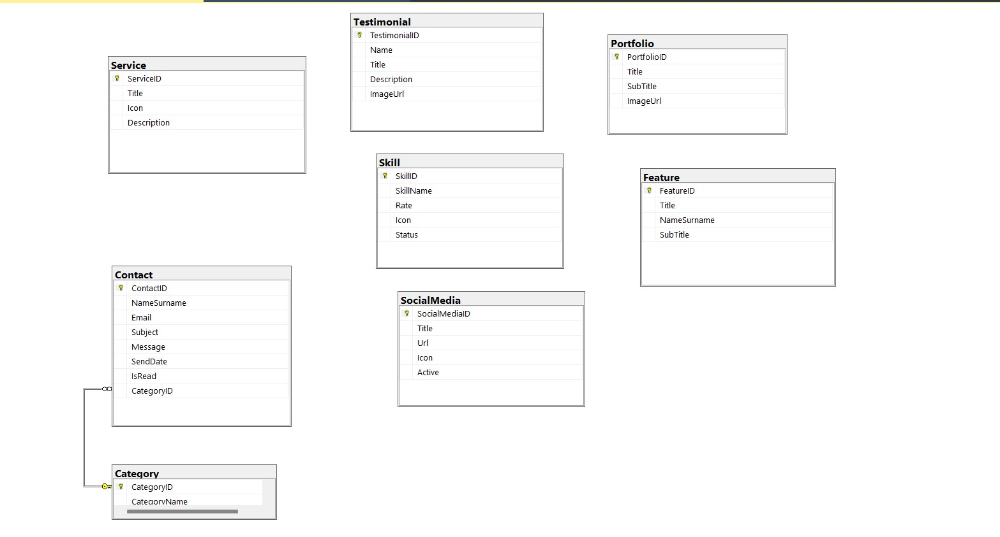
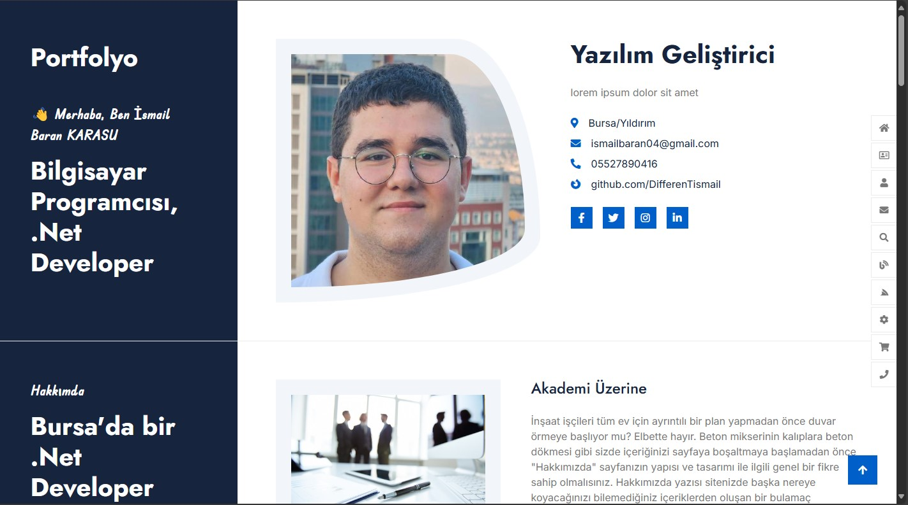
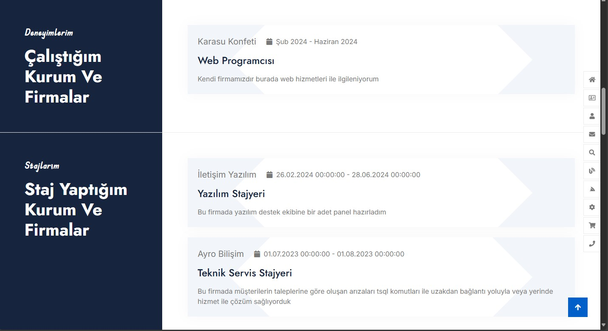
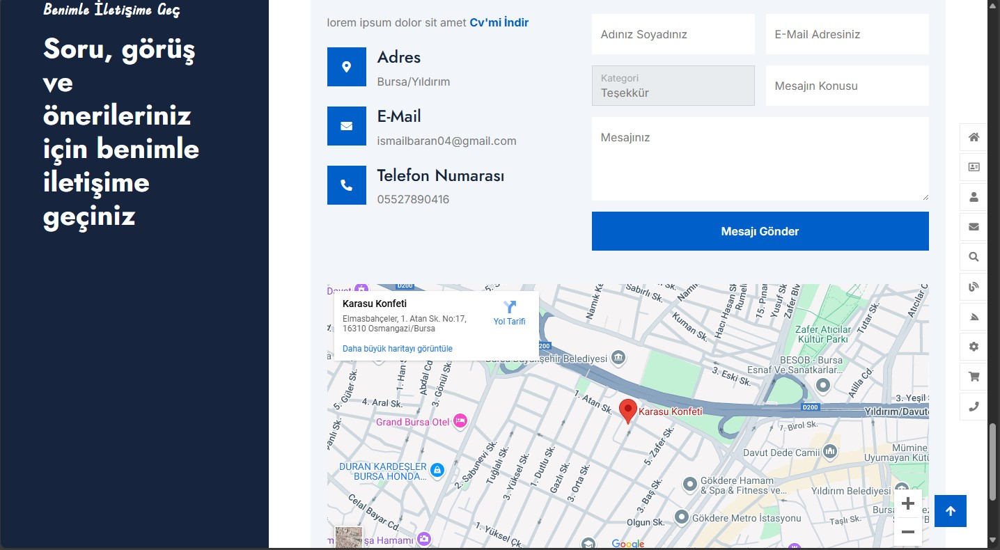
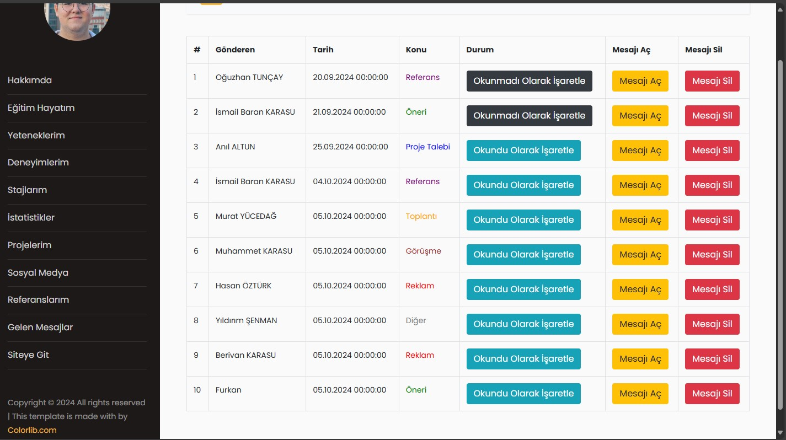
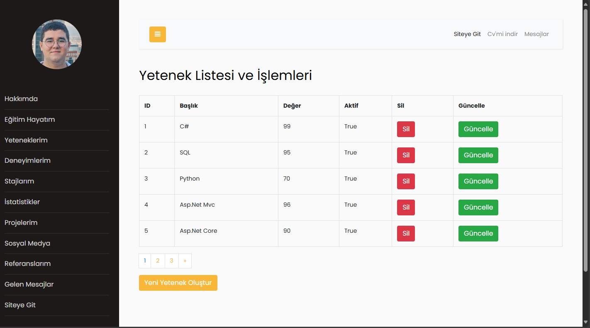
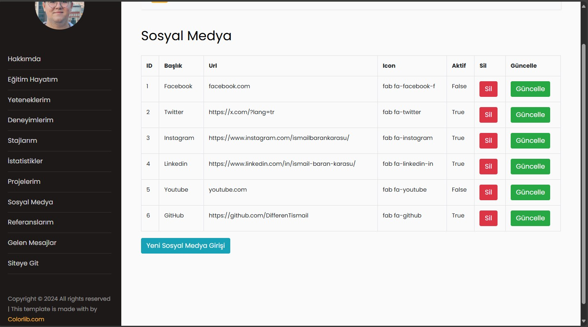

# 🌍 Portfolyo Projesi

### 🔎 PROJENİN TANIMI
Bu projede, geleneksel bir CV’yi interaktif ve dinamik bir web platformuna dönüştürdük. :sparkles: 

🌍 Kullanıcılar, kendi bilgilerini kolayca ekleyip güncelleyerek kişisel portföylerini oluşturabiliyorlar.

🖥️ Yönetici paneli, içerik yönetimini kolaylaştırmak için **Ekle/Sil/Güncelle/Listele** özellikleri sunuyor.

📈 **Grafikler ve İstatistikler** aracılığıyla veriler görselleştirildi ve kullanıcı deneyimi zenginleştirildi.

🗺️ Navigasyonu kolaylaştırmak için **NavBar** ve **Sidebar** gibi özellikler entegre edildi.

📥 Kullanıcıların CV’lerini indirebilmeleri için bağlantılar oluşturuldu.

🔗 Sosyal medya bağlantıları ile kullanıcı etkileşimi artırıldı.

✉️ Ziyaretçiler, **İletişim Formu** aracılığıyla mesaj bırakabilirler.

### 💻 KULLANILAN TEKNOLOJİLER
🔒 ASP.NET MVC Framework kullanılarak geliştirildi.

🔄 Entity Framework, veritabanı işlemleri için ORM aracı olarak tercih edildi.

📊 DB First yaklaşımı ile veritabanı oluşturuldu ve düzenlendi.

✅ CRUD işlemleri başarıyla uygulandı.

🎨 Arayüz tasarımı için HTML, CSS ve Bootstrap kullanıldı.

🔍 LINQ sorguları ile veri yönetimi sağlandı.

🗄️ MSSQL Server ile veritabanı yönetimi gerçekleştirildi.

📥 **DropDownList** ile veri çekme işlemleri yapıldı.

🔄 **PartialView** yapısı ile sayfalar arası geçişler kolaylaştırıldı.

📄 **Paging** özelliği ile Yetenekler sayfasının görünümü düzenlendi.

📊 **Chart.js Plugin** ile etkileyici grafikler oluşturuldu.

#### 🔒 **Veri Tabanı **


### 🎨 GÖRSELLER








## Kurulum Adımları

1. Depoyu klonlayın:
   ```bash
   git clone https://github.com/DifferenTismail/MyPortfolioProjectNight.git
   ```

2. **Visual Studio** ile projeyi açın.

3. NuGet paketlerini geri yüklemek için, çözüm üzerine sağ tıklayıp "NuGet Paketlerini Geri Yükle" seçeneğini seçin.

4. `web.config` dosyasındaki bağlantı dizesini kendi yerel SQL Server sunucunuza göre güncelleyin.

5. Visual Studio ile projeyi derleyip çalıştırın.

## Katkıda Bulunma

Bu projeyi forklayarak geliştirmelere katkıda bulunabilir veya iyileştirme önerileri için pull request açabilirsiniz.
